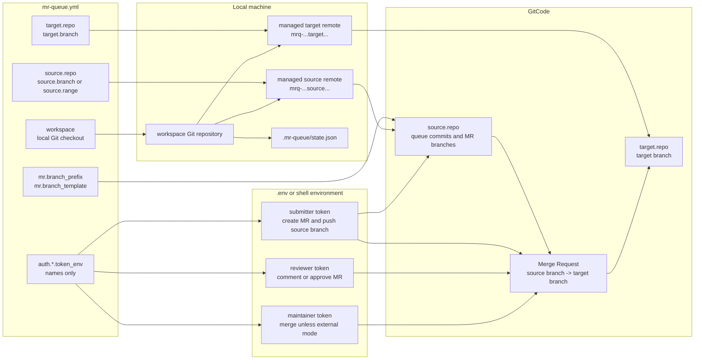
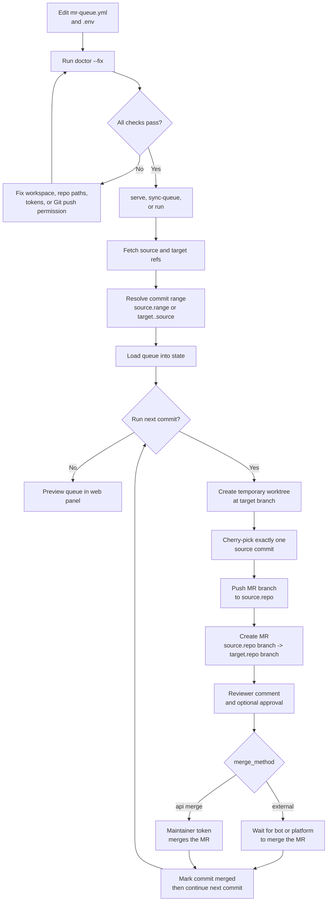

# mr-queue

`mr-queue` is a Go CLI with a local web panel for serial merge request queue automation.
The first provider adapter targets the GitCode/AtomGit service.

Use a source repository branch as the queue of prepared commits. `mr-queue`
processes one commit at a time:

1. fetch the source queue branch and target branch
2. read the next unmerged commit from the queue branch
3. create a temporary worktree at the latest target branch
4. cherry-pick exactly one queue commit onto a per-commit MR branch
5. push that MR branch to the source repository
6. create an MR from the source MR branch to the target branch
7. add the configured review comment and approval with the reviewer account
8. merge with the maintainer account
9. move to the next commit only after the current MR is merged

Tokens are read from `.env` through names configured in `mr-queue.yml`. Real token
values are not stored in YAML, logs, or the state file.

## Configuration Relationship

Simple Mode keeps the user-facing config small: name the local workspace, the
source repository, the target repository, MR branch naming, and token
environment variable names. `mr-queue` derives the local Git remotes from those
repository full paths and pushes generated MR branches back to `source.repo`.



Key relationships:

- `workspace` is a normal local Git checkout. You do not need to `cd` or
  `pushd` into a source remote.
- `source.repo` is both the queue source and the MR branch push destination.
- `target.repo` is where MRs are opened and eventually merged.
- local remotes are implementation details managed by `mr-queue`; users
  configure repository full paths instead of remote names.
- `.env` stores token values, while `mr-queue.yml` stores only token variable
  names.

## Operation Flow

Run `doctor --fix` before using the queue. It prepares managed remotes, checks
fetch access, verifies the resolved commit range, and performs a dry-run push to
confirm the submitter account can push MR branches to `source.repo`.



## Quick Start

Start from a local Git checkout of the project you want to use as the working
repository. This checkout is `workspace`; it can already have any remotes you
use for normal development, and `mr-queue` will add its own managed remotes when
`doctor --fix` runs.

1. Copy the example files:

```bash
cp mr-queue.yml.example mr-queue.yml
cp .env.example .env
```

2. Fill in the Simple Mode repository settings in `mr-queue.yml`:

```yaml
provider: gitcode
workspace: "/path/to/local/repo"

source:
  repo: "gitcode.com/your_namespace/project"
  branch: "queue"

target:
  repo: "gitcode.com/community/project"
  branch: "master"
```

For AtomGit repositories, use `provider: atomgit` and `atomgit.com/...` full
paths. GitCode and AtomGit share the same service family, so the same token
environment variables can be reused when the account has access.

`source.repo` is where queue commits are read from and where generated MR
branches are pushed. `target.repo` is where MRs are created. Use repository full
paths including the host, for example `gitcode.com/owner/repo` or
`atomgit.com/owner/repo`.

If you want a fixed commit range instead of `target..source`, configure one of
these under `source`:

```yaml
source:
  range: "a3c47d5f^..e34a0a61"
  # or:
  # start_sha: "a3c47d5f"
  # end_sha: "e34a0a61"
```

3. Fill in `.env` with token values:

```bash
GITCODE_SUBMITTER_TOKEN=replace-with-submit-token
GITCODE_REVIEWER_TOKEN=replace-with-review-token
GITCODE_MAINTAINER_TOKEN=replace-with-merge-token
```

For `workflow.merge_method: "external"`, the maintainer token is not required.
The submitter token must be able to create MRs and push branches to
`source.repo`; the reviewer token must be able to read, comment, or approve MRs
on `target.repo`.

4. Check and prepare the environment:

```bash
go run ./cmd/mr-queue doctor --config mr-queue.yml --fix
```

`doctor --fix` adds or updates managed local remotes, fetches source and target
refs, verifies the commit range, checks GitCode API access, and dry-runs a push
to `source.repo`. It does not create MRs or remote test branches.

5. Start the local web panel:

```bash
go run ./cmd/mr-queue serve --config mr-queue.yml
```

Open the panel:

```text
http://127.0.0.1:8787/
```

The web panel also has a “运行检查” section. Use it after changing config or
tokens.

6. Preload the queue without pushing branches or creating MRs:

```bash
go run ./cmd/mr-queue sync-queue --config mr-queue.yml
```

Syncing replaces the visible queue with the current configured `commit_range`,
so old range entries do not remain mixed into the panel. In the web panel, this
is the `同步队列` action.

7. Run the queue one commit at a time:

```bash
go run ./cmd/mr-queue run --config mr-queue.yml
```

In the web panel, use `运行下一条` for a single commit or `自动运行` to continue
through the queue with the configured delay and stop conditions.

Useful debug commands:

```bash
go run ./cmd/mr-queue dry-run --config mr-queue.yml
go run ./cmd/mr-queue doctor --config mr-queue.yml
```

`dry-run` prints the resolved config without exposing token values. Plain
`doctor` checks the current setup without modifying remotes.

When local refs are already up to date and the environment cannot write to the
target repository's `.git/FETCH_HEAD`, add `--skip-fetch` for preview-only local
debugging:

```bash
go run ./cmd/mr-queue sync-queue --config mr-queue.yml --skip-fetch
```

### What doctor checks

`doctor` checks:

- config loading and token environment variables
- whether `workspace` is a Git repository
- managed source/target remotes, with `--fix` adding or updating them
- source and target fetch connectivity
- source push authentication with `git push --dry-run`
- the resolved commit range
- GitCode target repository API access

It does not create MRs or push test branches. The push check is a dry run, so it
verifies credentials without creating the `*-doctor-check` branch on the remote.

### Git Account Check

`mr-queue` runs Git commands inside `workspace`; you do not need to `cd` or
`pushd` into a source remote. In Simple Mode, generated MR branches are pushed
to `source.repo`, so the submitter account must be allowed to create or update
branches there.

For the default HTTPS remotes derived from `source.repo`, `mr-queue` supplies
`auth.submitter.token_env` to Git through `GIT_ASKPASS`. Set that environment
variable to a GitCode token that can push to the source repository. If you
override a remote to use SSH, configure your local SSH key for the source
repository instead. `doctor` reports `git.source.push_auth` when this account
or key is not ready.

## Simple Mode

The recommended config names the source and target repositories directly:

```yaml
provider: gitcode
workspace: "/Users/qiny/codespace/syskits"

source:
  repo: "gitcode.com/smileQiny/syskits"
  branch: "new-features"

target:
  repo: "gitcode.com/openeuler/syskits"
  branch: "master"

mr:
  branch_prefix: "feat"
  branch_template: "{prefix}-{title_or_sha12}"
```

This means:

- read queue commits from `source.repo/source.branch`
- push generated MR branches back to `source.repo`
- create MRs into `target.repo/target.branch`
- automatically add or update managed remotes such as
  `mrq-gitcode-com-smileqiny-syskits`

If `source.range` is set, it is used as the exact commit range. Otherwise, if
`source.start_sha` and `source.end_sha` are set, the range is
`start_sha^..end_sha`. If no range is configured, `mr-queue` uses
`target branch..source branch` after fetching both repositories.

## MR Branch Names

In simple mode, MR branch names are configurable under `mr`:

```yaml
mr:
  branch_prefix: "mr-queue"
  branch_template: "{prefix}-{sha12}"
```

Advanced configs may still use the legacy `private` block:

```yaml
private:
  branch_prefix: "mr-queue"
  branch_template: "{prefix}-{sha12}"
```

For more readable per-commit branches, include the commit title:

```yaml
mr:
  branch_prefix: "feat"
  branch_template: "{prefix}-{title_or_sha12}"
```

Supported placeholders are `{prefix}`, `{title}`, `{title_or_sha12}`, `{sha12}`,
and `{sha}`. The title is converted to a safe branch slug and capped in length.
`{title}` falls back to `commit` if the title cannot produce a safe slug.
`{title_or_sha12}` falls back to the 12-character commit SHA instead.

## External Bot Merge Mode

For repositories where a bot merges after reviewer commands, set
`merge_method: "external"`. In this mode the tool waits for the configured CLA
comment, posts the reviewer command comment, and then polls the MR until the
platform reports it merged. It does not call the maintainer merge API.

```yaml
workflow:
  merge_method: "external"
  required_comment_text: "CLA Signature Pass"
  review_comment: |
    /lgtm
    /approve
  approve: false
  wait_check_delay_min: "10s"
  wait_check_delay_max: "30s"
  next_pr_delay_min: "1m"
  next_pr_delay_max: "5m"
```

`wait_check_delay_min` and `wait_check_delay_max` control how often the tool
checks waiting MRs for required comments or external merge completion.
`next_pr_delay_min` and `next_pr_delay_max` control the random delay after a
commit reaches `merged` before the next MR is created. The web panel lets you
override both delay ranges, the working time window, and maximum merged commits
for each automatic run. The merged limit counts only commits that reach `merged`
during that run.

## Build

```bash
go build -o dist/mr-queue ./cmd/mr-queue
```

Print version information:

```bash
go run ./cmd/mr-queue version
```

## Versioning And Releases

The project version lives in `VERSION`. Release binaries receive version metadata
through Go linker flags, so release builds report the tag, git commit, and build
time:

```bash
mr-queue version
```

GitHub Releases are built by `.github/workflows/release.yml` whenever a `v*` tag
is pushed. The workflow runs tests, builds Linux/macOS/Windows artifacts, writes
`checksums.txt`, and creates the GitHub Release.

Create and publish a GitHub release:

```bash
version="$(cat VERSION)"
git tag "v${version}"
git push github main
git push github "v${version}"
```

## Install From GitHub

Install the latest GitHub Release on Linux or macOS:

```bash
curl -fsSL https://raw.githubusercontent.com/smileQiny/mr-queue/main/scripts/install.sh | sh
```

Install a specific version:

```bash
curl -fsSL https://raw.githubusercontent.com/smileQiny/mr-queue/main/scripts/install.sh | \
  MR_QUEUE_VERSION=v0.1.2 sh
```

Install to a custom directory:

```bash
curl -fsSL https://raw.githubusercontent.com/smileQiny/mr-queue/main/scripts/install.sh | \
  INSTALL_DIR="$HOME/.local/bin" sh
```

Download a release artifact manually:

```bash
version="v0.1.2"
os="darwin"   # linux or darwin
arch="arm64"  # amd64 or arm64
curl -LO "https://github.com/smileQiny/mr-queue/releases/download/${version}/mr-queue_${os}_${arch}.tar.gz"
tar -xzf "mr-queue_${os}_${arch}.tar.gz"
sudo install -m 0755 "mr-queue_${os}_${arch}/mr-queue" /usr/local/bin/mr-queue
mr-queue version
```

Deploy the local web panel:

```bash
mkdir -p "$HOME/mr-queue"
cd "$HOME/mr-queue"
cp /path/to/mr-queue.yml .
cp /path/to/.env .
mr-queue serve --config mr-queue.yml --env .env --addr 127.0.0.1:8787
```

Run it in the background on macOS with `launchctl`:

```bash
home_dir="$HOME"
cat > "$HOME/Library/LaunchAgents/com.mr-queue.plist" <<PLIST
<?xml version="1.0" encoding="UTF-8"?>
<!DOCTYPE plist PUBLIC "-//Apple//DTD PLIST 1.0//EN" "http://www.apple.com/DTDs/PropertyList-1.0.dtd">
<plist version="1.0">
<dict>
  <key>Label</key><string>com.mr-queue</string>
  <key>ProgramArguments</key>
  <array>
    <string>/usr/local/bin/mr-queue</string>
    <string>serve</string>
    <string>--config</string>
    <string>${home_dir}/mr-queue/mr-queue.yml</string>
    <string>--env</string>
    <string>${home_dir}/mr-queue/.env</string>
    <string>--addr</string>
    <string>127.0.0.1:8787</string>
  </array>
  <key>RunAtLoad</key><true/>
  <key>KeepAlive</key><true/>
  <key>StandardOutPath</key><string>/tmp/mr-queue.log</string>
  <key>StandardErrorPath</key><string>/tmp/mr-queue.err.log</string>
</dict>
</plist>
PLIST

launchctl bootstrap "gui/$(id -u)" "$HOME/Library/LaunchAgents/com.mr-queue.plist"
launchctl kickstart -k "gui/$(id -u)/com.mr-queue"
```

Stop the macOS background service:

```bash
launchctl bootout "gui/$(id -u)" "$HOME/Library/LaunchAgents/com.mr-queue.plist"
```

## Same-Repository Test Loop

For a closed-loop test in your own fork, point `community` to the same repository
and set `queue.base_ref` to the target test branch, for example:

```yaml
queue:
  remote: "private"
  branch: "new-features"
  base_ref: "private/master-test"

community:
  remote: "private"
  owner: "smileQiny"
  repo: "syskits"
  branch: "master-test"
```

Click `同步队列` in the web panel first. That only loads commit metadata into the
state file. `运行下一条` and `自动运行` are the actions that push per-commit
branches, create MRs, review, and merge.

Before pushing an MR branch, `mr-queue` checks whether the exact commit patch is
already present on the target base branch. If it is already present, or if Git
reports an empty cherry-pick, the task is marked `skipped` and automatic runs
continue to the next commit without waiting for the next-PR delay.

If a task fails because `git cherry-pick` reports a merge conflict, the web queue
keeps the task failed until you choose how to retry that commit:

- `重试`: run the same cherry-pick again without a conflict strategy.
- `用提交内容重试`: resolve conflicted files with the queued commit content.
- `保留目标分支重试`: resolve conflicted files with the target branch content.

The last two choices only apply to that failed commit. They do not change the
global workflow or other queued commits.
